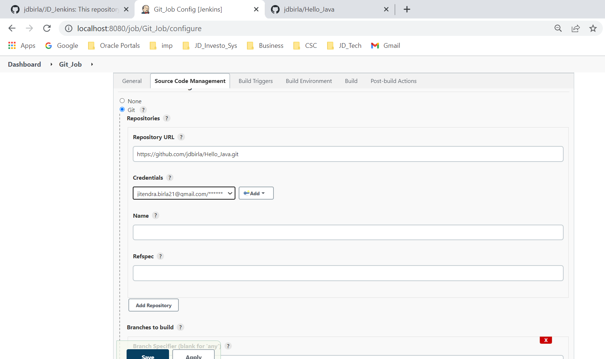

# JD Jenkins Leanrnings

1. simplilearn1 : https://www.youtube.com/watch?v=FX322RVNGj4
2. edureka : https://www.youtube.com/watch?v=p7-U1_E_j3w

## simplilearn1

## Overview:


---

## DevOps


---
## DevOps Tools


---
## DevOps Process


---
## DevOps Advantages


---
## Jenkins Installation


## Before Jenkins


## What is Jenkins?


## What is Continuous Integration?


## Continuous Integration Tools


## Features of Jenkins


## Jenkins Pipeline


## Jenkins Architecture


## Master-Slave Architecture


## Jenkins Case Study

## Key Takeaways


---
## Jenkins Practice





---

## Distributed Build


---
## Jenkins Pipeline


### pipeline basic syntax
```
pipeline {
    agent any
	stages {
        stage('Git-Checkout') {
            steps {
                echo 'Checking out from git'
            }
        }
		
	    stage('Build') {
            steps {
                echo 'Building the checkout project'
            }
        }
		
	    stage('Unit-Test') {
            steps {
                echo 'Running the unit test'
            }
        }
		
        stage('Quality-Gate') {
            steps {
                echo 'Verfying the quality gates'
            }
        }
    }
	post {
	    always{
		   echo 'This will always run'
		} 
		success{
		   echo 'This will run only if sucessful'
		} 
		failure{
		   echo 'This will run only if failed'
		} 
		unstable{
		   echo 'This will run only if the run was marked as unstable'
		} 
		changed{
		   echo 'This will only run if state  of the pipeline has been changed'
		   echo 'For example the pipeline was previouly failing but now sucessful'
		} 
	}
}

```

### pipeline basic syntax with github
```
pipeline {
    agent any
	stages {
        stage('Git-Checkout') {
            steps {
                echo 'Checking out from git';
                git 'https://github.com/jdbirla/Pipeline_Script.git'
            }
        }
		
	    stage('Build') {
            steps {
                echo 'Building the checkout project';
                bat 'Build.bat'
            }
        }
		
	    stage('Unit-Test') {
            steps {
                echo 'Running the unit test';
                bat 'Unit.bat'
            }
        }
		
        stage('Quality-Gate') {
            steps {
                echo 'Verfying the quality gates';
                bat 'Quality.bat'
            }
        }
        
        stage('Deploy') {
            steps {
                echo 'Deploying to stage env for more tests';
                bat 'Deploy.bat'
            }
        }
    }
	post {
	    always{
		   echo 'This will always run'
		} 
		success{
		   echo 'This will run only if sucessful'
		} 
		failure{
		   echo 'This will run only if failed'
		} 
		unstable{
		   echo 'This will run only if the run was marked as unstable'
		} 
		changed{
		   echo 'This will only run if state  of the pipeline has been changed'
		   echo 'For example the pipeline was previouly failing but now sucessful'
		} 
	}
}

```


---


